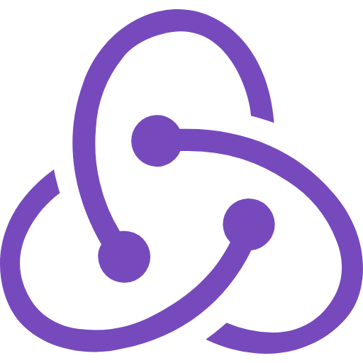

I'm curious by nature and always looking for ways to improve, whether it's through learning something new or solving a tough problem. I enjoy working with others, sharing ideas, and building useful software. For me, coding is a creative process that blends logic and innovation. I believe in making things that are practical, efficient, and easy to use. Let's keep learning, keep building, and keep moving forward.

<h2>Stack</h2>
 

  <!-- Row 1 -->
  
  
  
  
  
  
  
  
  
  
  
  
  
    

  <!-- Row 2 -->
  
  
  
  
  
  
  
  
  
  
  
  
  
  

<h2>Contact Information</h2>

Email: ivanmarichalus@gmail.com

  LinkedIn: <a href="https://www.linkedin.com/in/ivan-marichal/">ivan marichal</a>

